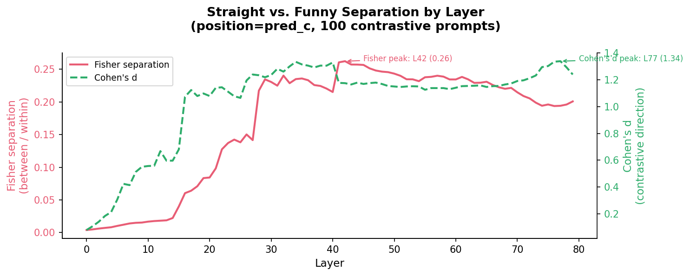
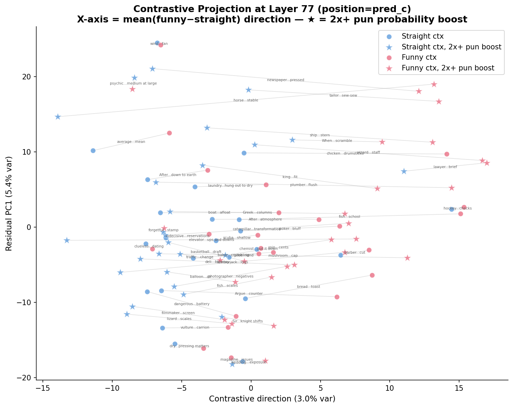
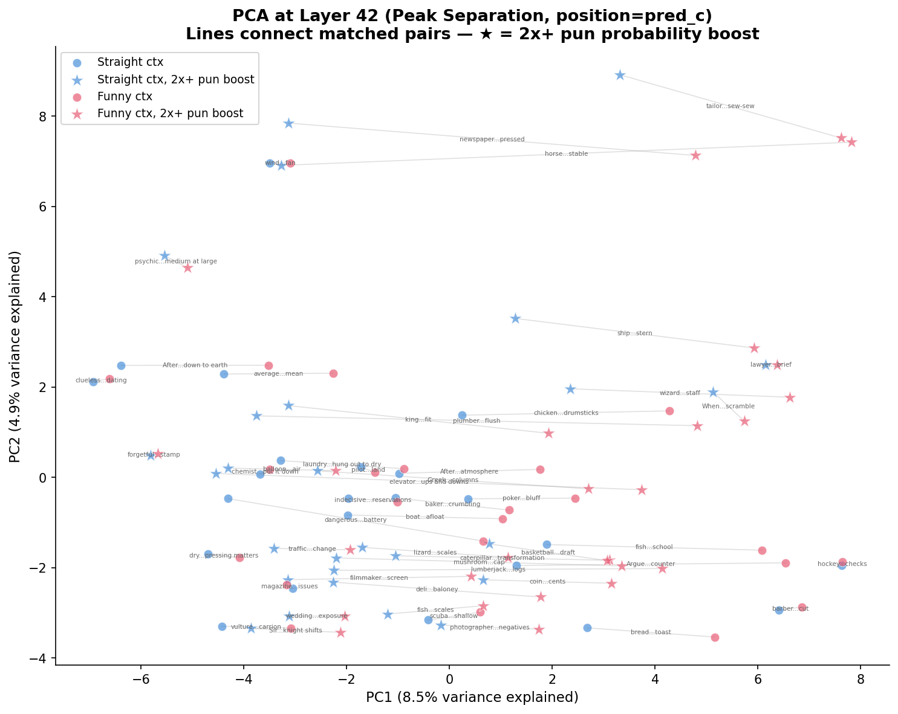
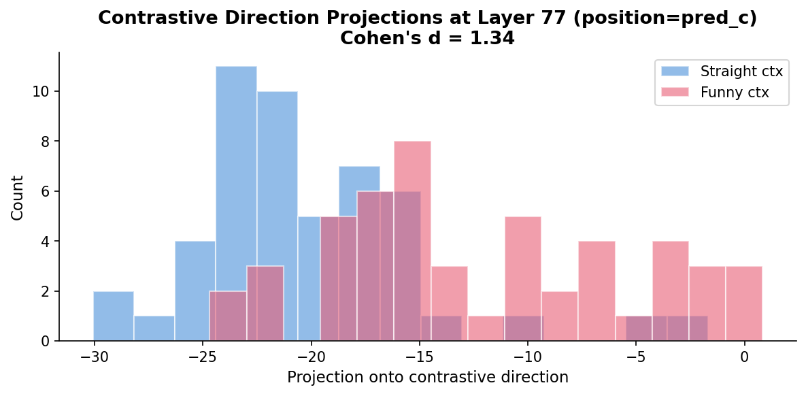
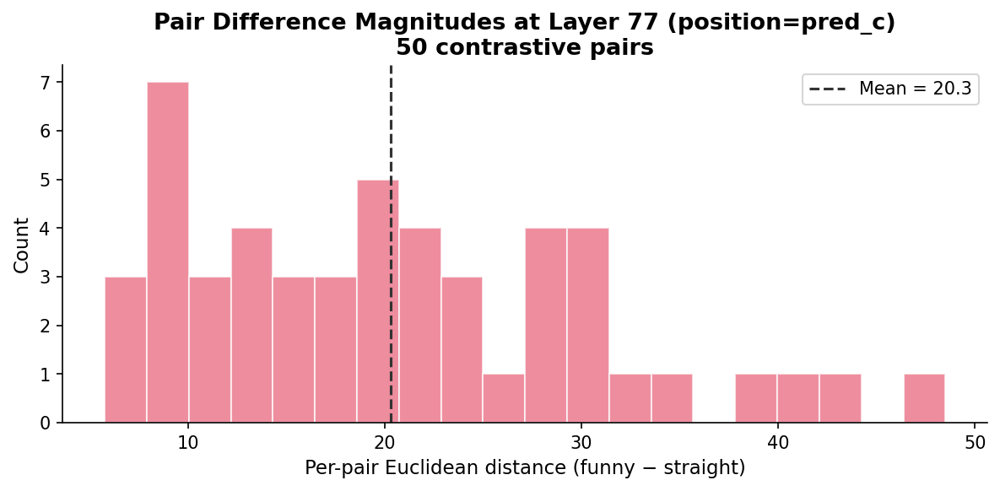

# Contrastive Activation Analysis

This document describes the internal-representation analysis phase of the
pun-awareness project.  The behavioral experiments
([EXPERIMENTS.md](EXPERIMENTS.md)) established that 70B+ Llama models have
contextually-activated pun awareness: they produce pun completions at high
rates when surrounded by punny context, but rarely in straight context.

The question now: **where in the network does this happen?**

## Goal

Locate and characterize the internal activation patterns that distinguish
"pun mode" from "straight mode" across the layers of Llama-3.1-70B-Instruct.
Specifically:

1. **At which layers** do funny-primed and straight-primed activations
   separate?  Is it early, late, or does it emerge gradually?
2. **How large** is the separation?  Is there a clear direction in activation
   space that encodes the funny/straight distinction?
3. **Is the signal paired?**  Do matched pairs (same target joke, different
   context) show consistent difference vectors, or is the separation driven
   by a few outliers?

## Data Collection

**Script:** [`collect_activations.py`](collect_activations.py)

We collect hidden-state activations from Llama-3.1-70B-Instruct (80 layers,
hidden dim 8192) via [NDIF](https://ndif.us/), a remote inference service
that provides access to model internals.

For each of the 100 contrastive cloze prompts (50 pairs × 2 conditions),
we extract the residual-stream activation vector at a specified token position.

### Token Positions

Two positions are collected independently:

| Position | Description | Why |
|----------|-------------|-----|
| `pred_c` | Last token of the prompt (predicting C's completion word) | The point of decision — where the model must choose straight or funny |
| `pred_b` | Last token before B's completion word (predicting B's answer) | An earlier position where contextual priming should already be building |

### Output Format

Per position, the collection produces:
- **80 layer files** — each `(100, 8192)` float32 array (one row per prompt)
- **1 metadata file** — JSON with model info, prompt text, pair IDs, and
  sample types (straight/funny)

Files are stored in `results/raw_activations/`.

## Analysis Methods

**Script:** [`analyze_activations.py`](analyze_activations.py)

All analysis functions are pure numpy (no sklearn or plotting dependencies),
designed for import into notebooks or other scripts.

### Separation Metrics

We track two complementary metrics across all 80 layers:

**Fisher separation** — ratio of between-group centroid distance to average
within-group spread:

$$\text{Fisher} = \frac{\|\mu_{\text{funny}} - \mu_{\text{straight}}\|}{\frac{1}{2}(\bar{d}_{\text{straight}} + \bar{d}_{\text{funny}})}$$

This measures whether the two groups occupy distinct regions of activation
space, accounting for overall spread.  It operates in the full 8192-dimensional
space and makes no assumptions about the direction of separation.

**Cohen's d** — standardized mean difference along the contrastive direction:

$$d = \frac{\bar{x}_{\text{funny}} - \bar{x}_{\text{straight}}}{\sigma_{\text{pooled}}}$$

where projections are onto the mean pair-difference direction.  This measures
how well the specific funny−straight signal separates the groups, ignoring
variance in orthogonal directions.  Cohen's d is more sensitive to
directional separation even when the full-space clusters overlap.

### Contrastive Direction

The **contrastive direction** is the mean of per-pair difference vectors:

$$\hat{d} = \text{normalize}\left(\frac{1}{N}\sum_{i=1}^{N} (x_i^{\text{funny}} - x_i^{\text{straight}})\right)$$

This is a single unit vector in the 8192-dimensional hidden space that
captures the average direction along which funny and straight activations
differ.  Unlike PCA, which finds directions of maximum overall variance
(which might be dominated by content variation unrelated to the
funny/straight distinction), the contrastive direction specifically targets
the paired difference signal.

### Projection Methods

**Standard PCA** decomposes activations into principal components via SVD.
This finds the directions of greatest overall variance, which may or may
not align with the funny/straight distinction.

**Contrastive projection** uses the contrastive direction as axis 1, then
performs PCA on the residual (the component of each activation orthogonal to
the contrastive direction) to find axis 2+.  This creates a view where:

- **X-axis** = projection onto contrastive direction (funny−straight signal)
- **Y-axis** = largest residual variance direction (captures other structure)

The contrastive projection is more informative than PCA when the
funny/straight signal is present but does not dominate the total variance
(i.e., when PC1 captures content variation rather than the experimental
manipulation).

### Per-Pair Analysis

Since every prompt has a matched pair (same target sentence, different
context), we can analyze the signal at the pair level:

- **Pair differences** — the 50 individual (funny − straight) vectors in
  the full hidden space
- **Pair distances** — Euclidean magnitude of each pair's difference vector
- **Distance histogram** — distribution of pair distances at peak layers,
  showing whether separation is uniform or driven by outlier pairs

## Visualization

**Script:** [`visualize_activations.py`](visualize_activations.py)

Six diagnostic plots are generated per token position:

### 1. Separation Curves

`{pos}_separation_curves.png`

Fisher separation and Cohen's d plotted across all 80 layers on a dual
y-axis.  Annotated with peak-layer markers.  This is the primary diagnostic
for identifying which layers carry the funny/straight signal.

### 2. PCA Scatter by Layer

`{pos}_pca_by_layer.png`

Standard PCA scatter plots (PC1 vs PC2) at quartile layers plus the Fisher
peak layer.  Points colored by condition (blue = straight, red = funny).
Shows whether the funny/straight groups visually separate in the top-2
variance directions at different depths.

### 3. PCA at Peak Layer

`{pos}_pca_peak_layer.png`

Detailed PCA scatter at the Fisher-peak layer.  Gray lines connect each
matched pair (same target, different context).  Shows both group separation
and individual pair structure.

### 4. Contrastive Projection Scatter

`{pos}_contrastive_scatter.png`

Contrastive projection at the peak Cohen's d layer.  X-axis is the
contrastive direction (funny−straight signal), y-axis is residual PC1.
Pair lines show how each pair moves along the contrastive axis.  This
is the most direct view of the experimental signal.

### 5. Pair-Difference Histogram

`{pos}_pair_diff_histogram.png`

Distribution of per-pair Euclidean distances at the peak layer.  Shows
whether the contrastive signal is uniform across pairs or concentrated
in a subset.

### 6. Contrastive Direction Projections

`{pos}_mean_diff_projection.png`

Overlapping histograms of funny vs. straight activations projected onto
the contrastive direction.  Shows 1D separation with Cohen's d annotation.

## Running the Analysis

```bash
# Collect activations (requires NDIF access)
python3 collect_activations.py --position pred_c
python3 collect_activations.py --position pred_b

# Generate all visualizations
python3 visualize_activations.py --position pred_c
python3 visualize_activations.py --position pred_b

# Analyze specific layers only
python3 visualize_activations.py --position pred_c --layers 20 40 60
```

### Using the Analysis API Directly

```python
from analyze_activations import *

meta, layer_data, layer_indices = load_activations(
    "results/raw_activations/llama31_70b_instruct_pred_c_meta.json"
)

# Separation metrics across all layers
results = analyze_all_layers(layer_data, meta)
print(f"Fisher peak: layer {results['peak_fisher_layer']}")
print(f"Cohen's d peak: layer {results['peak_cohens_d_layer']}")

# Contrastive projection at a specific layer
X = layer_data[60]
X_proj, components, var_ratios = contrastive_projection(X, meta, n_components=2)

# Per-pair analysis
diffs = pair_differences(X, meta)      # (50, 8192) difference vectors
dists = pair_distances(X, meta)        # (50,) Euclidean distances
d_vec = contrastive_direction(X, meta) # (8192,) unit vector
```

## Results

*Results will be added here once activation collection via NDIF completes.
The figures referenced above will be generated by `visualize_activations.py`
and placed in `results/figures/`.*

<!-- Uncomment and update when results are available:

### pred_c Position (Predicting C's Completion)

**Separation curves:**



**Contrastive projection at peak layer:**



**PCA at peak layer with pair lines:**



**1D projection histogram:**



**Pair difference magnitudes:**



### pred_b Position (Predicting B's Completion)


-->

## Interpretation Guide

**What to look for in the separation curves:**

- A flat curve near zero means the layer does not distinguish funny from
  straight activations.
- A rising curve suggests the funny/straight signal is being constructed
  at that depth.
- A peak followed by a decline suggests the signal is most distinct at
  intermediate layers and then compressed or overwritten in later layers.
- If Fisher and Cohen's d peak at the same layer, the contrastive direction
  aligns with the dominant separation direction.  If Cohen's d peaks later,
  the funny/straight signal may be a secondary component that grows while
  other variance shrinks.

**What to look for in the contrastive projection:**

- Clear horizontal separation (left = straight, right = funny) confirms
  a strong contrastive signal.
- Pair lines that are mostly horizontal mean each pair's context shift is
  captured by the contrastive direction — the signal is consistent.
- Pair lines at steep angles mean the context shift has a large component
  orthogonal to the mean direction — individual pairs may have idiosyncratic
  representations.

**What to look for in pair distances:**

- A tight distribution with a high mean suggests a consistent, uniform
  context effect across all 50 joke pairs.
- A long right tail or bimodal distribution suggests some pairs are much
  more affected by context than others — worth investigating which jokes
  drive the signal.
