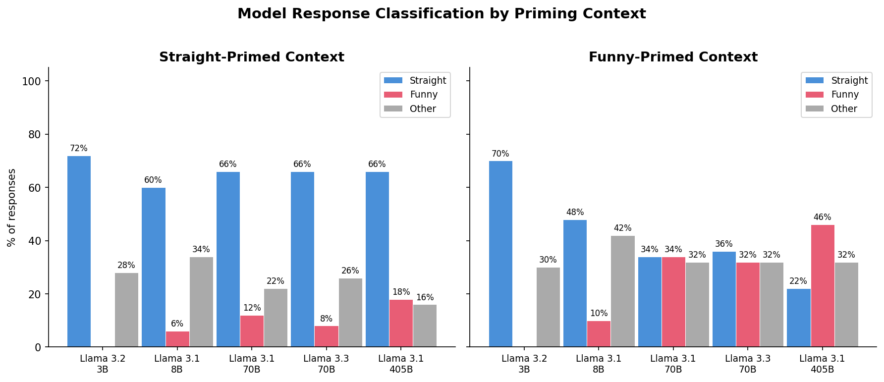
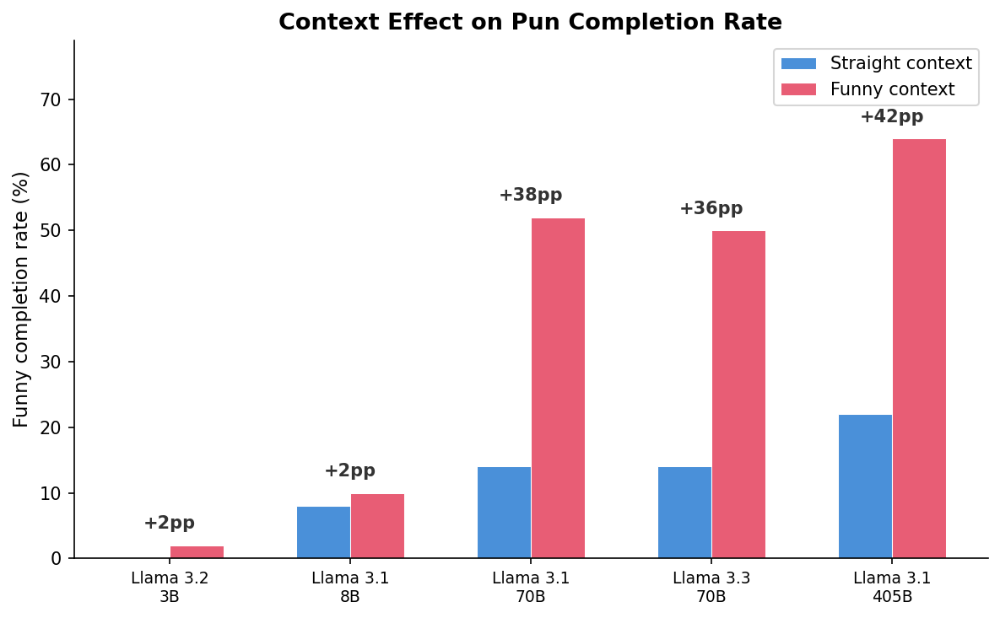

# Experiments

## Experiment 1: Pun Awareness Across Model Sizes

### Motivation

Do language models "get" puns? When a sentence has a blank that could be
filled with either a literal word or a pun, do models prefer the pun — and
does surrounding context influence that choice?

We test this using **contrastive cloze prompts**: each test presents a model
with two context sentences (filled in either with straight or punny words)
followed by a target sentence truncated before its blank. If models are
sensitive to contextual priming, they should produce more pun completions
when the context sentences use puns, and more straight completions when
the context uses literal words.

### Experiment Design

**Dataset.** 50 target jokes selected from balanced and leaning tiers (jokes
where models naturally split between straight and funny completions). Each
target is paired with two context jokes from the straight-dominated tier.
See [DATASET.md](DATASET.md) for dataset construction details.

**Test structure.** Each of 50 joke triples (A, B, C) generates two test prompts:
- **Straight-primed:** A and B filled with their top straight word, C truncated
- **Funny-primed:** A and B filled with their top pun word, C truncated

Total: 100 test prompts (50 pairs x 2 conditions).

**Models.** Five Llama models spanning 3B to 405B parameters, all accessed
via Together.ai with greedy decoding (temperature=0):

| Nickname | Model |
|----------|-------|
| 3b | meta-llama/Llama-3.2-3B-Instruct-Turbo |
| 8b | meta-llama/Meta-Llama-3.1-8B-Instruct-Turbo |
| 70b | meta-llama/Meta-Llama-3.1-70B-Instruct-Turbo |
| 3.3-70b | meta-llama/Llama-3.3-70B-Instruct-Turbo |
| 405b | meta-llama/Meta-Llama-3.1-405B-Instruct-Turbo |

**Classification.** Each model response is classified as **straight**, **funny**,
or **other** by matching the extracted first word against the joke's curated
word lists in `datasets/puns_205.json`.

### Code

| Script | Purpose |
|--------|---------|
| `run_cloze_benchmark.py` | Send all 100 test prompts to each model via Together.ai. Saves raw responses to `results/cloze_benchmark_raw.json` with checkpoint/backfill support. |
| `analyze_cloze_results.py` | Classify responses, compute per-model context-effect metrics, generate tables and plots. Outputs `results/cloze_analysis.json` and `results/figures/`. |

### Results

#### Response Classification by Context

| Model | Context | Straight | Funny | Other |
|-------|---------|:--------:|:-----:|:-----:|
| Llama-3.2-3B | straight | 56% | 26% | 18% |
| | funny | 48% | 32% | 20% |
| Llama-3.1-8B | straight | 54% | 20% | 26% |
| | funny | 36% | 44% | 20% |
| Llama-3.1-70B | straight | 16% | 78% | 6% |
| | funny | 10% | 76% | 14% |
| Llama-3.3-70B | straight | 12% | 78% | 10% |
| | funny | 4% | 84% | 12% |
| Llama-3.1-405B | straight | 12% | 86% | 2% |
| | funny | 6% | 90% | 4% |

#### Context Effect: Funny-Rate Shift

| Model | P(funny \| straight ctx) | P(funny \| funny ctx) | Delta |
|-------|:-:|:-:|:-:|
| Llama-3.2-3B | 26% | 32% | +6pp |
| Llama-3.1-8B | 20% | 44% | +24pp |
| Llama-3.1-70B | 78% | 76% | -2pp |
| Llama-3.3-70B | 78% | 84% | +6pp |
| Llama-3.1-405B | 86% | 90% | +4pp |

#### Plots

**Response classification by priming context:**

**Funny completion rate by context (with delta annotations):**

### Key Findings

1. **Pun awareness scales with model size.** Small models (3B, 8B) default to
   straight completions (54-56% straight in neutral/straight context), while
   large models (70B+) overwhelmingly prefer puns (78-90% funny) regardless
   of context.

2. **The 8B model shows the strongest context effect.** Its funny rate jumps
   from 20% to 44% (+24pp) when switching from straight to funny context —
   the largest shift of any model. This suggests 8B sits at a capacity
   threshold where pun awareness exists but is not yet dominant, making it
   most susceptible to contextual priming.

3. **Large models are pun-saturated.** The 70B, 3.3-70B, and 405B models
   produce puns 76-90% of the time even with straight priming context. The
   context effect is small (+4 to +6pp) because the baseline funny rate is
   already near ceiling. These models have internalized the pun structure so
   thoroughly that straight context barely suppresses it.

4. **The 3B model is pun-naive.** It shows only a +6pp context effect but for
   a different reason than the large models: it mostly doesn't recognize the
   pun opportunity at all (only 26-32% funny), regardless of priming.

5. **There is a "Goldilocks zone" for contextual influence.** Models need
   enough capacity to recognize puns (3B is too small) but not so much that
   pun completion is automatic (70B+ is saturated). The 8B model occupies this
   zone, making it the most interesting target for interpretability analysis.
