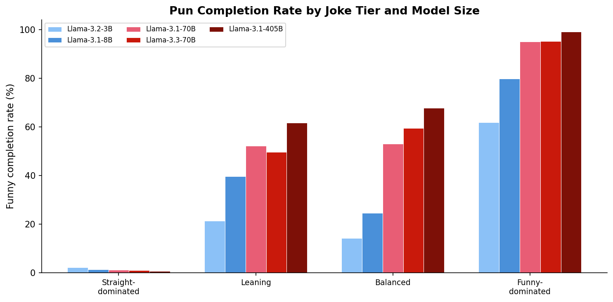

# Do LLMs Know What a Pun Is?

**Research question:** Do large language models know what a pun is?
How do they represent that awareness?  And does pun awareness play any
role beyond forming a joke to make people laugh?

This project is a research demo developed as part of
[Neural Mechanics](https://neural-mechanics.baulab.info/), a course on
understanding the internal mechanisms of neural networks.  The goal is to
fully develop an example piece of new research using the methods of the
class: creating datasets with large-scale LLMs, selecting target models,
measuring model behavior, and isolating internal representations.

## Why Puns?

Humor is not well-understood, and it's fun to study.  But puns are
interesting for deeper reasons than entertainment.

A pun is a word that holds **two meanings at the same time**.  "Battery"
is both a criminal charge and an iPhone component.  "Draft" is both an
NBA selection and the start of a manuscript.  This is a form of
**superposition in visible human vocabulary** — a single token encoding
two distinct concepts simultaneously.

This connects to one of the central phenomena we study in Neural Mechanics:
the **superposition hypothesis**, where neural network features are packed
into fewer dimensions than there are concepts to represent.  Puns are a
case where this sparse coding isn't hidden inside activations — it's right
there in the words themselves.  How deep does this visible superposition go?
How difficult is it for models to wrestle with two meanings at once?

Humans find puns funny, especially kids, and we don't fully understand why.
What is the purpose of humor?  One possibility is that the recognition of
double meaning — the moment of *seeing both readings at once* — is itself
the cognitive event that produces the feeling of humor.  If so, then pun
awareness in a language model might be more than a party trick.  It might
reflect something about how the model processes ambiguity, resolves
polysemy, and represents the relationships between concepts.

So we want to isolate the processing of puns: see what triggers it, test
whether we can suppress it, and ask what happens to the model when we do.
**Does pun awareness play any other role beyond forming a joke?**

## The Setup

Every pun has two readings: a **straight** (literal) meaning and a **funny**
(double-meaning) interpretation.  For example:

> The dangerous iPhone was arrested and charged with ___

The straight completion is something like "assault" or "theft."  The pun
completion is "battery" — which means both a criminal charge and an iPhone
component.

If a language model "gets" the joke, it should be able to produce the pun
word.  And if the model has some internal representation of pun-awareness,
we should be able to activate or suppress it by manipulating context.

## Step 1: Building the Dataset

**Scripts:** [`datasets/rawdata/analyze_jokes.py`](datasets/rawdata/analyze_jokes.py),
[`datasets/rawdata/repair_jokes.py`](datasets/rawdata/repair_jokes.py),
[`datasets/rawdata/apply_edits.py`](datasets/rawdata/apply_edits.py),
[`datasets/rawdata/build_puns_205.py`](datasets/rawdata/build_puns_205.py)

We started with a small seed of fill-in-the-blank pun sentences and used
Claude, Gemini, and ChatGPT to expand the pool to ~1,000 candidate jokes.
Each LLM was then used as a critic — rating every joke on a 0–10 scale for
how well the pun works, with explanations of the double meaning.

The rating prompt asks models to act as comedy critics:

> *Rating guidelines:*
> *8–10: Exceptional — surprising pun, tight double meaning, natural setup.*
> *6–7: Good — solid pun with clear double meaning.*
> *4–5: Average — predictable or forced.*
> *2–3: Weak — double meaning is a stretch.*
> *0–1: Bad — barely works.*

Jokes scoring below 7.0 (averaging Gemini and Claude ratings) were sent back
to Claude for creative repair — fixing contradictory setups, forced phrasing,
and weak double meanings
([`repair_jokes.py`](datasets/rawdata/repair_jokes.py)).

After automated repair, a final **hand-editing pass** polished the jokes:
fixing sentence wording, removing duplicates, and ensuring each pun lands
cleanly.  The result is [`datasets/puns_205.json`](datasets/puns_205.json):
**205 high-quality fill-in-the-blank pun sentences**, each with curated
straight and punny completion lists.

See [DATASET.md](DATASET.md) for full construction details.

## Step 2: Measuring Model Performance

**Scripts:** [`datasets/annotate_completions.py`](datasets/annotate_completions.py),
[`analyze_baseline_performance.py`](analyze_baseline_performance.py)

With 205 jokes in hand, we test five Llama models (3B to 405B parameters)
on their ability to predict pun completions.  For each joke, the sentence
is truncated before the blank and sent to each model.  We collect **20
diverse samples** (temperature=0.8) plus **1 greedy sample** (temperature=0)
per model per joke — over 21,000 completions total.

### Discovering Novel Completions

The models produce many completions beyond the ones we initially curated.
A model might respond "bass" to a fish-and-guitar joke, or "fly" to a
pilot joke — valid puns that weren't in our original lists.

We handle this by sending all novel completion words to Claude for
classification as **straight** (literal), **funny** (pun/wordplay), or
**other** (doesn't fit).  This expands the straight and punny word lists
for each joke, ensuring our measurements capture the full range of model
creativity.

### Baseline Results

Larger models produce pun completions more often, even without any special context:

| Model | Avg Funny Rate |
|-------|:-:|
| Llama-3.2-3B | 16% |
| Llama-3.1-8B | 25% |
| Llama-3.1-70B | 36% |
| Llama-3.3-70B | 36% |
| Llama-3.1-405B | 41% |

But this average masks an important structure.  We classify jokes into
**four tiers** based on how models naturally split between straight and funny:



At one extreme, **funny-dominated** jokes (24 of 205) are puns that every
model gets, even the smallest.  These are jokes where the pun word is
practically the only sensible completion:

> *The arctic navigator was great at parties because he knew how to break the ___*
> → "ice" (100% pun rate across all models)

In the **balanced** middle (42 jokes), models split between straight and
funny completions, and size matters — bigger models get the joke more often:

> *The crab never shared his toys because he was ___*
> → "shellfish" (pun) vs. "greedy" (straight).  The 3B and 8B models always
> say "greedy"; the 405B model says "shellfish" every time.

At the other extreme, **straight-dominated** jokes (88 of 205) have
near-zero pun rates across all models — the pun is there, but no model
recognizes it:

> *The tailor won his court case because he had an excellent ___*
> → "suit" (pun) vs. "lawyer" (straight).  Every model at every size says
> "lawyer."  Zero pun completions.

These straight-dominated jokes become the key targets for the next step:
can we *make* the model see the pun by manipulating context?

## Step 3: Isolating Pun Awareness

**Scripts:** [`datasets/build_cloze_tests.py`](datasets/build_cloze_tests.py),
[`run_cloze_benchmark.py`](run_cloze_benchmark.py),
[`analyze_cloze_results.py`](analyze_cloze_results.py)

Beyond raw performance, we want to isolate **pun awareness** — the model's
ability to recognize and respond to a pun-inviting context.

The key insight is that each joke can be stated in two ways: a **straight
way** that isn't funny, and a **punny way** that is.  Many of our jokes,
seen in isolation, don't seem like jokes at all — models naturally
complete them with literal words.  But what if we surround them with
sentences that have already been completed as puns?

### Contrastive Cloze Design

We select 50 **straight-dominated** jokes as targets — jokes where models
default to the literal completion.  Each target is paired with two context
jokes that have clear straight/funny word pairs.  This generates 100 test
prompts: 50 with straight-primed context and 50 with funny-primed context.

For example, a funny-primed prompt might look like:

> *The dieter went to the paint store to get **thinner**.
> The two antennas met on a roof and the wedding had excellent **reception**.
> The dangerous iPhone was arrested and charged with*

### Results

The context effect scales monotonically with model size:


| Model | Straight ctx | Funny ctx | Delta |
|-------|:-:|:-:|:-:|
| Llama-3.2-3B | 0% | 2% | +2pp |
| Llama-3.1-8B | 8% | 10% | +2pp |
| Llama-3.1-70B | 14% | 52% | **+38pp** |
| Llama-3.3-70B | 14% | 50% | **+36pp** |
| Llama-3.1-405B | 22% | 64% | **+42pp** |

**Key findings:**

1. **3B and 8B models are pun-blind.** They produce almost no pun
   completions regardless of context (+2pp or less).

2. **A phase transition occurs between 8B and 70B.** The context effect
   jumps from +2pp to +38pp — a 19x increase.  This suggests pun-in-context
   recognition requires a threshold level of model capacity.

3. **70B+ models have latent pun awareness.** They rarely produce puns in
   straight context (14–22%), but funny context reliably activates pun
   completions (50–64%).  The 405B model shows the strongest effect: +42pp.

4. **Straight completions are suppressed by funny context.** For 70B+ models,
   straight rates drop from 70–74% to 26–42% — confirming the context
   manipulation genuinely shifts model behavior.


See [EXPERIMENTS.md](EXPERIMENTS.md) for full experimental details.

## Next Steps

With behavioral evidence that 70B+ models have contextually-activated pun
awareness, the next phase of this research will use the interpretability
methods from [Neural Mechanics](https://neural-mechanics.baulab.info/) to
locate and understand the internal representations that drive this behavior:

- **Where** in the model does pun-awareness emerge?  At what layer does the
  model begin to represent the double meaning?
- **What** internal features distinguish "pun mode" from "straight mode"?
  Is there a sparse feature or direction in activation space that encodes
  pun-awareness?
- **Can** we causally intervene to activate or suppress pun completion?
  If we clamp the pun-awareness feature off, does the model lose the
  ability to make jokes?
- **Does pun awareness serve any other purpose?**  If we suppress the
  feature that drives pun completion, does the model also lose something
  else — the ability to process polysemy, to handle ambiguity, to reason
  about words with multiple meanings?  Or is pun-awareness a narrow,
  isolated skill?

## Project Structure

```
datasets/
  puns_205.json                    205 curated pun sentences
  contextual_cloze_tests_100.json  100 contrastive test prompts
  annotate_completions.py          Collect & classify model completions
  build_cloze_tests.py             Build contrastive test prompts
  rawdata/                         Early-phase scripts and data
    analyze_jokes.py               Multi-provider joke rating
    repair_jokes.py                Weak joke repair via Claude
    apply_edits.py                 Hand-edit application
    build_puns_205.py              Final dataset assembly

run_cloze_benchmark.py             API scraper for contrastive tests
analyze_cloze_results.py           Contrastive experiment analysis
analyze_baseline_performance.py    Baseline pun-rate analysis

results/
  cloze_benchmark_raw.json         Raw model responses
  cloze_analysis.json              Classified results
  figures/                         Generated plots
```

| Document | Contents |
|----------|----------|
| [DATASET.md](DATASET.md) | Dataset construction pipeline |
| [EXPERIMENTS.md](EXPERIMENTS.md) | Experiment design and results |
